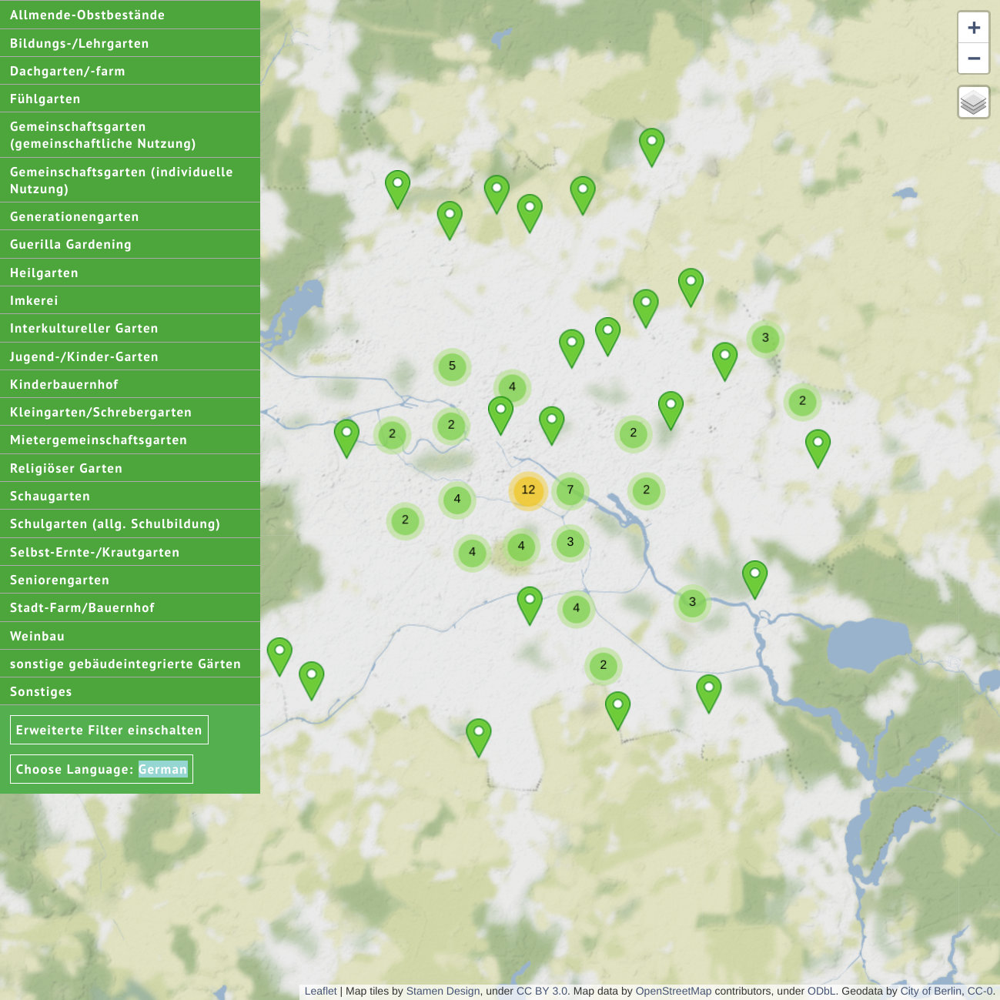

# Berliner Gartenkarte 2017

What you are finding here is the source code repository of Berlin's urban agriculture map. It displays the field of intercultural, community and plentiful other forms of urban gardening initatives. It is live on [`gartenkarte.de`](http://gartenkarte.de).

The software is derived from the [TransforMap Viewer](https://github.com/TransforMap/transformap-viewer/) ([demo](http://viewer.transformap.co/)) and is accompanied by a data transformation strategy, custom icons and integration with other services from the [Transformaps ecosystem](https://discourse.transformap.co/t/introducing-the-transformap-testbed-architecture/1273). This web map displays data from the [TransforMap data service](https://github.com/TransforMap/data.transformap.co) and uses dynamic filters which are curated in a [wiki database](https://base.transformap.co).

## Communication

To get in touch with the maintainers of this project, you have several options. If you want to report a technical deficiency, please adhere to [the issue tracker](https://github.com/gartenkarte/gartenkarte-2017/issues). For all other subjects, feel free to reach out

* in the [`#transformaps-development:matrix.allmende.io`](https://riot.allmende.io/#/room/#transformaps-development:matrix.allmende.io) Riot chat messaging channel.
* in the [Transformaps Discourse](https://discourse.transformap.co/) community bulletin board.
* on [Twitter @transformap](https://twitter.com/transformap).

## Documentation

A rolling documentation is written in the textpad [`gartenkarte-2017-web`](https://hack.allmende.io/gartenkarte-2017-web).
Further documents reside [in the `docs/` subdirectory](./docs/README.md).

## License

This repository is licensed under the WTFPL. See the LICENCE file in this repository for details. Please take this exemplary excerpt to grasp its coverage:

> **DO WHAT THE FUCK YOU WANT**
