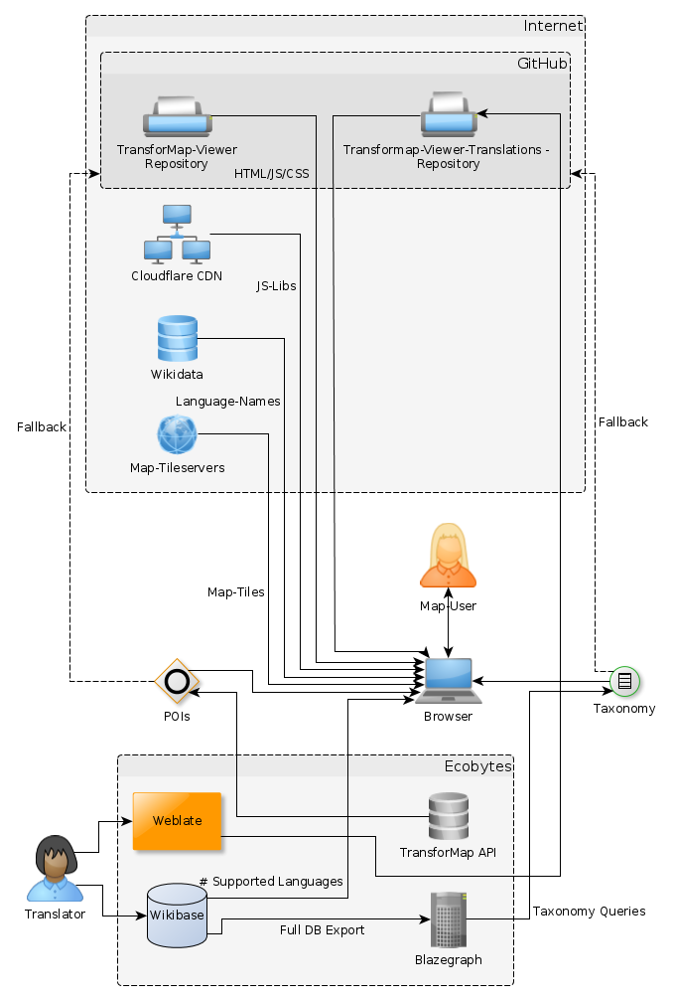

### 2.3. Development notes

> [Berliner Gartenkarte 2017](https://github.com/gartenkarte/gartenkarte-2017/)

#### Setup

For this to work you need to have a working Node.JS installation with NPM. We suggest to use [NVM](http://nvm.sh) for managing versions and updates.

First clone the repository to your local computer:

    git clone https://github.com/gartenkarte/gartenkarte-2017.git

and change directory `cd gartenkarte-2017`. If your only wish is to serve the site, you are basically done. Skip the next section and read on at [deployment](#deployment).

#### Developing

Run `npm install` once to install needed development dependencies.

### build concatenated and minified js/css

Then, run `npm run build` each time js and/or css has been changed to update the content in the `/dist` folder.

## CSS

Is created via [less](http://lesscss.org/).

Do not edit the CSS file in styles/css/style.css, edit styles/less/style.less and compile to css.

Install node *less* compiler to convert the stylesheet to less css:

* Debian: `aptitude install node-less`

Compile it via :

lessc -x styles/less/style.less styles/css/style.css

##### Data flows

This service relies heavily on different linked data backends, see flowchart:

##### Style guide

We use spaces (2) instead of tabs, please also use this convention.

#### Distribution

#### Deployment

The site can be deployed with any HTTP server that serves static content. Instructions about how to set these up to serve from this repository can be found within their respective user manuals.

Originally deployed via GitHub pages, the `gh-pages` branch has been deprecated in favour of an always deployable `master`. It is prepared to be served as a static site via Dokku
